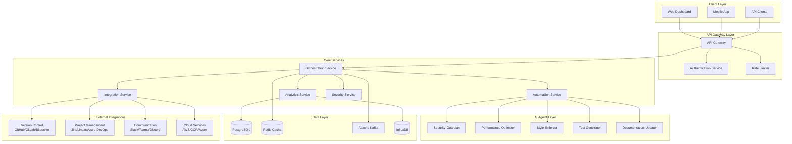

# Design Document

## Overview

DevFlow.ai is designed as a cloud-native, microservices-based platform that orchestrates AI-powered development workflows. The architecture follows enterprise patterns with event-driven communication, horizontal scalability, and zero-trust security. The system integrates deeply with existing development tools while providing intelligent automation through specialized AI agents.

## Architecture

### High-Level Architecture



### Microservices Architecture

The platform consists of five core microservices, each with specific responsibilities:

1. **API Gateway Service**: Entry point for all client requests
2. **Orchestration Service**: Central workflow coordination and event management
3. **Analytics Service**: Metrics collection, processing, and predictive modeling
4. **Automation Service**: AI agent execution and hook management
5. **Integration Service**: External API connections and data synchronization

## Components and Interfaces

### API Gateway Service

**Responsibilities:**
- Request routing and load balancing
- Authentication and authorization
- Rate limiting and security enforcement
- API versioning and documentation

**Key Interfaces:**
```typescript
interface APIGatewayConfig {
  routes: RouteDefinition[];
  authProviders: AuthProvider[];
  rateLimits: RateLimitConfig[];
  securityPolicies: SecurityPolicy[];
}

interface RouteDefinition {
  path: string;
  method: HttpMethod;
  targetService: string;
  authRequired: boolean;
  rateLimit?: RateLimitConfig;
}
```

### Orchestration Service

**Responsibilities:**
- Workflow state management
- Event bus coordination
- Multi-agent task distribution
- Context-aware decision making

**Key Interfaces:**
```typescript
interface WorkflowOrchestrator {
  createWorkflow(definition: WorkflowDefinition): Promise<Workflow>;
  executeWorkflow(workflowId: string, context: WorkflowContext): Promise<WorkflowResult>;
  pauseWorkflow(workflowId: string): Promise<void>;
  resumeWorkflow(workflowId: string): Promise<void>;
}

interface WorkflowDefinition {
  id: string;
  name: string;
  triggers: EventTrigger[];
  steps: WorkflowStep[];
  agents: AgentAssignment[];
}
```

### Analytics Service

**Responsibilities:**
- DORA metrics tracking
- Predictive timeline estimation
- Technical debt analysis
- Team performance insights

**Key Interfaces:**
```typescript
interface AnalyticsEngine {
  trackMetric(metric: MetricData): Promise<void>;
  generateReport(reportType: ReportType, filters: ReportFilters): Promise<Report>;
  predictTimeline(projectData: ProjectData): Promise<TimelinePrediction>;
  analyzeTechnicalDebt(codebase: CodebaseData): Promise<TechnicalDebtAnalysis>;
}

interface DORAMetrics {
  deploymentFrequency: number;
  leadTimeForChanges: number;
  changeFailureRate: number;
  timeToRestoreService: number;
}
```

### Automation Service

**Responsibilities:**
- AI agent lifecycle management
- Hook execution coordination
- Automated task scheduling
- Agent performance monitoring

**Key Interfaces:**
```typescript
interface AutomationEngine {
  registerAgent(agent: AIAgent): Promise<void>;
  executeHook(hookId: string, context: HookContext): Promise<HookResult>;
  scheduleTask(task: AutomatedTask): Promise<void>;
  monitorAgentPerformance(agentId: string): Promise<PerformanceMetrics>;
}

interface AIAgent {
  id: string;
  name: string;
  capabilities: AgentCapability[];
  execute(context: AgentContext): Promise<AgentResult>;
}
```

### Integration Service

**Responsibilities:**
- External API management
- Webhook processing
- Data synchronization
- Third-party authentication

**Key Interfaces:**
```typescript
interface IntegrationManager {
  registerIntegration(integration: Integration): Promise<void>;
  syncData(integrationId: string, syncType: SyncType): Promise<SyncResult>;
  processWebhook(webhook: WebhookPayload): Promise<void>;
  authenticateThirdParty(provider: string, credentials: Credentials): Promise<AuthToken>;
}

interface Integration {
  id: string;
  provider: IntegrationProvider;
  config: IntegrationConfig;
  syncSchedule: SyncSchedule;
}
```

## Data Models

### Core Domain Models

```typescript
// Workflow Management
interface Workflow {
  id: string;
  name: string;
  status: WorkflowStatus;
  definition: WorkflowDefinition;
  context: WorkflowContext;
  createdAt: Date;
  updatedAt: Date;
}

// Team and User Management
interface Team {
  id: string;
  name: string;
  members: TeamMember[];
  projects: Project[];
  settings: TeamSettings;
}

interface Developer {
  id: string;
  email: string;
  name: string;
  teams: Team[];
  skills: Skill[];
  preferences: DeveloperPreferences;
}

// Project and Repository
interface Project {
  id: string;
  name: string;
  repositories: Repository[];
  team: Team;
  integrations: Integration[];
  workflows: Workflow[];
}

// Analytics and Metrics
interface MetricData {
  id: string;
  type: MetricType;
  value: number;
  timestamp: Date;
  projectId: string;
  metadata: Record<string, any>;
}

// AI Agent Models
interface AgentExecution {
  id: string;
  agentId: string;
  workflowId: string;
  status: ExecutionStatus;
  input: AgentInput;
  output: AgentOutput;
  startTime: Date;
  endTime?: Date;
}
```

### Database Schema Design

**PostgreSQL Tables:**
- `teams` - Team information and settings
- `users` - User profiles and authentication data
- `projects` - Project metadata and configuration
- `workflows` - Workflow definitions and state
- `integrations` - Third-party integration configurations
- `agent_executions` - AI agent execution history
- `audit_logs` - Security and compliance audit trail

**InfluxDB Time Series:**
- `dora_metrics` - Deployment frequency, lead time, etc.
- `performance_metrics` - System and application performance data
- `agent_performance` - AI agent execution metrics
- `user_activity` - User interaction and engagement metrics

## Error Handling

### Error Classification

1. **System Errors**: Infrastructure failures, service unavailability
2. **Integration Errors**: Third-party API failures, authentication issues
3. **Validation Errors**: Invalid input data, constraint violations
4. **Business Logic Errors**: Workflow execution failures, agent errors

### Error Handling Strategy

```typescript
interface ErrorHandler {
  handleError(error: Error, context: ErrorContext): Promise<ErrorResponse>;
  retryOperation(operation: Operation, retryConfig: RetryConfig): Promise<OperationResult>;
  escalateError(error: CriticalError): Promise<void>;
}

interface RetryConfig {
  maxAttempts: number;
  backoffStrategy: BackoffStrategy;
  retryableErrors: ErrorType[];
}
```

### Circuit Breaker Pattern

Implement circuit breakers for external integrations to prevent cascade failures:

```typescript
interface CircuitBreaker {
  execute<T>(operation: () => Promise<T>): Promise<T>;
  getState(): CircuitBreakerState;
  reset(): void;
}
```

## Testing Strategy

### Testing Pyramid

1. **Unit Tests (70%)**
   - Individual service logic
   - AI agent algorithms
   - Data model validation
   - Utility functions

2. **Integration Tests (20%)**
   - Service-to-service communication
   - Database operations
   - External API integrations
   - Event bus messaging

3. **End-to-End Tests (10%)**
   - Complete workflow execution
   - User journey validation
   - Performance benchmarks
   - Security compliance

### AI Agent Testing

```typescript
interface AgentTestSuite {
  testAgentCapabilities(agent: AIAgent): Promise<TestResult>;
  validateAgentOutput(input: AgentInput, output: AgentOutput): Promise<ValidationResult>;
  benchmarkAgentPerformance(agent: AIAgent): Promise<PerformanceBenchmark>;
}
```

### Load Testing Strategy

- **Workflow Orchestration**: Test 10,000 concurrent workflow executions
- **Analytics Processing**: Validate real-time metrics processing under load
- **Integration Throughput**: Test external API rate limit handling
- **Agent Execution**: Benchmark AI agent performance at scale

### Security Testing

- **Penetration Testing**: Regular security assessments
- **Vulnerability Scanning**: Automated security scanning in CI/CD
- **Compliance Validation**: SOC2, GDPR, HIPAA compliance testing
- **Authentication Testing**: Multi-factor authentication and SSO validation

## Performance Considerations

### Scalability Design

- **Horizontal Scaling**: All services designed for horizontal scaling
- **Database Sharding**: Partition data by team/organization
- **Caching Strategy**: Multi-layer caching with Redis
- **CDN Integration**: Static asset delivery optimization

### Performance Targets

- **API Response Time**: < 200ms for 95th percentile
- **Workflow Execution**: < 30 seconds for standard workflows
- **Analytics Queries**: < 3 seconds for standard reports
- **Real-time Updates**: < 5 seconds for status changes

### Monitoring and Observability

```typescript
interface MonitoringSystem {
  trackMetric(metric: string, value: number, tags: Tags): void;
  logEvent(event: LogEvent): void;
  createAlert(condition: AlertCondition): Promise<Alert>;
  generateHealthCheck(): Promise<HealthStatus>;
}
```

## Security Architecture

### Zero Trust Implementation

- **Identity Verification**: Multi-factor authentication required
- **Least Privilege Access**: Role-based access control (RBAC)
- **Network Segmentation**: Microservice isolation
- **Continuous Monitoring**: Real-time security event detection

### Data Protection

- **Encryption at Rest**: AES-256 encryption for all stored data
- **Encryption in Transit**: TLS 1.3 for all communications
- **Key Management**: Hardware security modules (HSM) for key storage
- **Data Classification**: Automatic PII detection and protection

### Compliance Framework

```typescript
interface ComplianceEngine {
  validateCompliance(data: any, standard: ComplianceStandard): Promise<ComplianceResult>;
  generateAuditReport(timeRange: TimeRange): Promise<AuditReport>;
  trackDataAccess(userId: string, dataType: string): Promise<void>;
}
```

This design provides a robust, scalable foundation for DevFlow.ai that addresses all the requirements while maintaining enterprise-grade security, performance, and reliability standards.